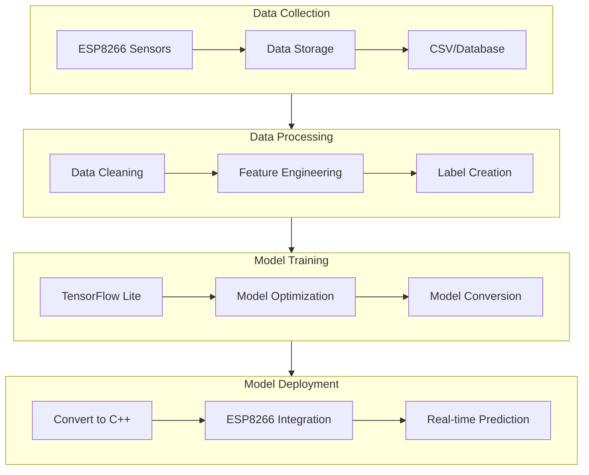

# Plant Water Prediction with TinyML

## Architecture Overview

## Implementation Plan

### 1. Data Collection Phase
- Modify current ESP8266 code to:
  - Log sensor readings (soil moisture, temperature, humidity, light)
  - Add timestamps to data
  - Store readings in a structured format
  - Implement data logging mechanism
  - Create system for labeling watering events

### 2. Data Processing Phase
- Data cleaning and preprocessing:
  - Remove outliers and invalid readings
  - Handle missing values
  - Normalize sensor data
- Feature engineering:
  - Create time-based features
  - Calculate rolling averages
  - Generate derived metrics
- Label creation:
  - Map watering events to data points
  - Define "needs water" threshold

### 3. Model Training Phase
- TensorFlow Lite setup:
  - Select appropriate model architecture
  - Configure for microcontroller constraints
  - Implement training pipeline
- Model optimization:
  - Quantization
  - Pruning
  - Architecture optimization
- Validation and testing

### 4. Deployment Phase
- ESP8266 integration:
  - Convert model to C array
  - Implement inference code
  - Update web interface
  - Add real-time predictions
- Testing and validation:
  - Verify accuracy
  - Measure performance
  - Monitor memory usage

## Technical Requirements

### Hardware
- ESP8266 NodeMCU
- DHT22 sensor
- Soil moisture sensor
- LDR sensor

### Software
- PlatformIO IDE
- Python environment for ML:
  - TensorFlow
  - TensorFlow Lite
  - Data processing libraries
- ESP8266 libraries:
  - ESP8266WiFi
  - ESP8266WebServer
  - TensorFlow Lite for ESP

### Storage
- SPIFFS filesystem for data logging
- SD card module (optional for larger datasets)

## Next Steps
1. Set up data collection system
2. Collect initial dataset (minimum 1 week of readings)
3. Develop and test ML model
4. Deploy and validate on ESP8266